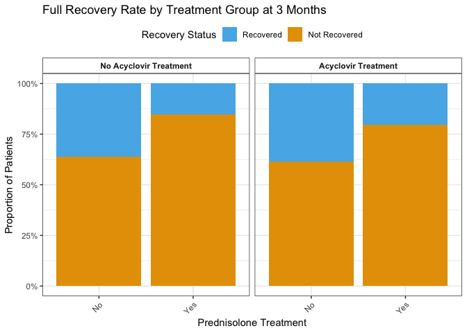
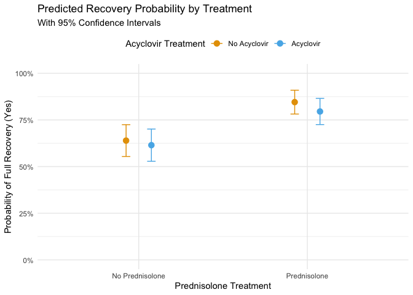

Patient Outcomes for 2 Drug Combinations In Cerebral Palsy Patients
================
Alex Cory
2025-05-07

- [Introduction](#introduction)
- [Data](#data)
- [Results](#results)
- [Discussion](#discussion)

## Introduction

The data used in this analysis is synthetic data for corticosteroids and
antiviral agents as treatment for Bell’s Palsy. It was generated to
simulate but obfuscate findings from the study *Early Treatment with
Prednisolone or Acyclovir in Bell’s Palsy* by Sullivan et al (2007).

The full journal can be found in the New England Journal of Medicine:
<https://www.nejm.org/doi/full/10.1056/nejmoa072006#>

The Kaggle dataset can be found here:
<https://www.kaggle.com/datasets/dillonmyrick/bells-palsy-clinical-trial?resource=download>

The scientific question we seek to answer is: How does early treatment
of Bell’s Palsy with a combination of Prednisolone, Acyclovir, and
placebo effect outcomes over a 3 month period

## Data

The dataset contains 494 observations, with each row representing a
patient. Each patient receives two pills, one being a steroid
(Prednisolone) or placebo, and the other being an antiviral (Acyclovir)
or placebo.

| Treatment Group        | Subjects in Group | Number Recovered | Proportion |  %  |
|:-----------------------|:-----------------:|:----------------:|:----------:|:---:|
| Prednisolone–Placebo   |        123        |       104        | 0.8455285  | 85% |
| Acyclovir–Prednisolone |        127        |       101        | 0.7952756  | 80% |
| Placebo–Placebo        |        122        |        78        | 0.6393443  | 64% |
| Acyclovir–Placebo      |        122        |        75        | 0.6147541  | 61% |

Proportion of Full Recovery by Treatment Group Over 3 Month Period

<!-- -->  
From our data we observe that the group with the best 3 month outcome is
the Prednisolone-Placebo group (84.4% Recovery), and the worst is the
Acyclovir-Placebo group (61.4% Recovery). This suggests evidence that
Prednisolone performs better than placebo, whereas Acyclovir performs
worse than placebo, although more rigorous testing would need to be
performed to conclude if these effects are significant.

## Results

|                                                |   OR | 2.5 % | 97.5 % |
|:-----------------------------------------------|-----:|------:|-------:|
| (Intercept)                                    | 1.77 |  1.23 |   2.58 |
| Received.PrednisoloneYes                       | 3.09 |  1.69 |   5.80 |
| Received.AcyclovirYes                          | 0.90 |  0.53 |   1.51 |
| Received.PrednisoloneYes:Received.AcyclovirYes | 0.79 |  0.34 |   1.81 |

Odds Ratios (OR) with 95% CIs

<!-- -->

The model used is logistic regression using the interaction term between
the two treatments. This model is used because the outcome is binary.
The model is also highly interpretable and allows us to study how
treatment effects recovery odds.

#### Findings

#### Prednisolone

- OR = 3.09 (95% CI: 1.69-5.8)
- Patients receiving Prednisolone had 3.1 times higher odds of recovery

#### Acyclovir

- OR = 0.9 (95% CI: 0.53-1.51)
- moderate increase in recovery odds

#### Interaction

- OR = 0.79 (95% CI: 0.34-1.81)
- No evidence of synergistic effects due to 1 being contained within the
  95% confidence interval

## Discussion

#### Summary

  The data for this analysis was obtained via Kaggle, and was
simulated based on the findings of *Early Treatment with Prednisolone or
Acyclovir in Bell’s Palsy* by Sullivan et al (2007). We performed a
logistic regression on our dataset due to the ease of explanation, which
is extremely important in the healthcare field due to both ethical and
legal concerns. We found that Prednisolone Monotherapy was the best
treatment, and Acyclovir Monotherapy was the worst treatment.

#### Assumptions

  Independence: Independence was controlled for as this data was
generated based on the results of a randomized double-blind experiment
where assignments were done independently of one another.

Distributional Assumptions: The model assumes a binomial distribution of
outcomes for recovery status after 3 months. Normality is required for
sampling distribution of parameter estimates, which is achieved through
central limit theorem (n=494).

Parameter Assumptions: Log-Odds of recovery are assumed to be linear in
predictors, which is validated by the lack of significance in the
interaction between drug treatments (Interaction OR = 0.79).

#### Generalizability and Causality

  This dataset can be generalized to a broader audience. The sample
was taken from a variety of patients with early Bell’s Palsy, 72 hours
within presentation of symptoms with no pre-existing facial nerve
damage. It is not generalizable to individuals who do not meet the
inclusion criteria.

We are able to conclude a causal effect between treatment and outcome.
This was a double-blind experiment, which is the gold standard for
medical trials for establishing a causal relationship. The odds ratio
can be interpreted as the causal effect for each treamtnet.
